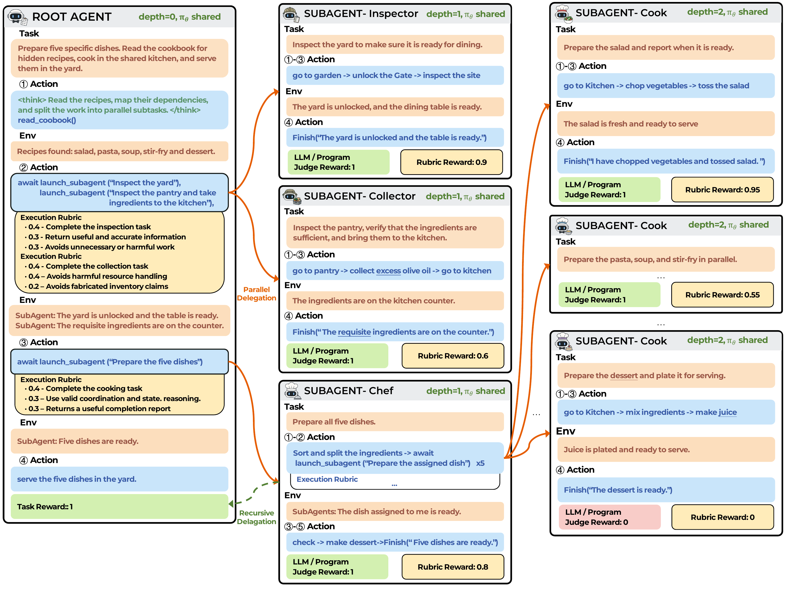
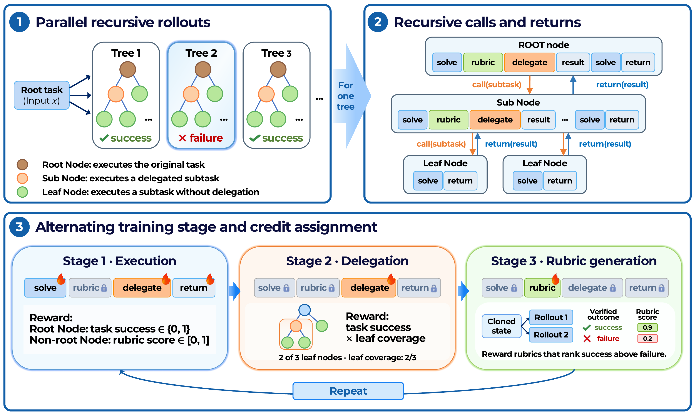

<p align="center">
  
</p>

# SERA: Self-Evaluating Recursive Agents

<p align="center">
  
  <a href="https://github.com/OliverLeeXZ/SERA"></a>
  <a href="https://huggingface.co/Litux12138/SERA"></a>
  
</p>

SERA trains **one recursive language-model policy** to decompose tasks, solve
subtasks, and evaluate its own work. Before delegating, a parent agent writes a
weighted rubric for the child. The same policy later scores the child's result
against that frozen rubric, providing a continuous execution reward. Training
the rubric to distinguish verified successful from unsuccessful continuations
turns self-evaluation into a learned capability rather than a fixed prompt.

This repository contains the training recipes, fixed datasets, evaluation
programs, and test-time scaling code, and links to the public TextCraft-Synth
and TextWorld-Sync checkpoints.

## Highlights

1. **Self-evaluating execution:** policy-generated, subtask-specific rubrics
   provide continuous credit to recursive agents. The root task remains
   programmatically verified.
2. **Credit for decomposition:** a leaf-coverage reward credits delegation
   decisions according to the work organized by their subtrees, separately
   from execution and rubric-generation tokens.
3. **Rubrics trained on verified outcomes:** counterfactual continuations teach
   a rubric to rank successes above failures. TextCraft uses a program
   verifier; TextWorld uses an external judge *for rubric training*, while
   ordinary rubric-based execution uses the policy's own scores.
4. **Inference-time reuse:** the learned rubric can also select among recursive
   candidate resolutions in TextWorld-Sync Best-of-N evaluation.

## Method overview

SERA uses a shared policy throughout a recursive tree of agents. Each agent can
act in the environment, delegate a subtask, and continue after receiving its
result. The policy also writes and applies the rubrics that evaluate delegated
work.

<p align="center">
  
</p>

Figure 1 illustrates recursive execution and subtask evaluation. Parents commit
weighted rubrics before their children execute, and completed subtasks return
results to the parent. The root receives the environment's task-success reward.
The scoring sources shown serve different roles: Recursive Agent Optimization
(RAO) directly rewards subagent execution with program or LLM judge outcomes,
while SERA uses the policy's rubric scores for execution and verified outcomes
to train rubric generation.

<p align="center">
  
</p>

Figure 2 shows how SERA assigns credit across three alternating training stages.
Execution rewards train agent trajectories using root-task success or subtask
rubric scores. Leaf-coverage rewards train delegation goals according to their
subtree's share of the leaves in a successful task. Rubric-generation rewards
train evaluation criteria to rank verified successful continuations above
failed ones from the same cloned state. The colored token spans identify which
parts receive updates in each stage; rubric scoring itself receives no gradient.

The full SERA recipe repeats these stages in a **16:2:2** cycle. The same stage
kernel also runs the RAO and ablation recipes, so method comparisons share the
training infrastructure.

## Benchmarks and checkpoints

| Benchmark | Evaluation tasks | Public checkpoint | Training step |
| --- | ---: | --- | ---: |
| TextCraft-Synth | 632 | [TextCraft-step250](https://huggingface.co/Litux12138/SERA/tree/main/TextCraft-step250) | 250 |
| TextWorld-Sync | 1,400 | [TextWorld-step400](https://huggingface.co/Litux12138/SERA/tree/main/TextWorld-step400) | 400 |

Both benchmarks contain Easy, Medium, Hard, and Extreme tasks. TextWorld-Sync
extends TextWorldExpress CookingWorld into a shared-state, recursive
multi-agent environment with seven task families; its fixed test set has 350
tasks per difficulty. The datasets are bundled in [Dataset/](Dataset/README.md),
including the TextWorld generation program. The reported three-run mean
success rates for SERA are **74.31%** on TextCraft-Synth and **65.07%** on
TextWorld-Sync; see the paper for full difficulty breakdowns and comparisons.

## Quickstart: download and evaluate

Use Python 3.12 and a CUDA/PyTorch environment compatible with the pinned
dependencies. From the repository root:

```bash
pip install -r requirements.txt
python Scripts/Download/download.py

# Inspect settings first; these commands do not start model servers or use GPUs.
bash Scripts/Eval/evaluate_textcraft_ckpt.sh --dry-run
bash Scripts/Eval/evaluate_textworld_ckpt.sh --dry-run

# Run the full recursive-agent evaluations.
bash Scripts/Eval/evaluate_textcraft_ckpt.sh
bash Scripts/Eval/evaluate_textworld_ckpt.sh
```

The download command reads the public
[SERA model repository](https://huggingface.co/Litux12138/SERA) and stores its
two Hugging Face-format checkpoints under `Evaluation/ckpt/` (ignored by Git).
Use `--checkpoint textcraft` or `--checkpoint textworld` to download only one.
The evaluation launchers start local vLLM replicas on visible GPUs, evaluate
the fixed test sets, aggregate results, and stop only the servers they started.
Results default to ignored, timestamped directories under `Evaluation/outputs/`.
If you have another HF-format model, use
`Scripts/Eval/textcraft/run.sh` or `Scripts/Eval/textworld/run.sh` with its path
instead. Single-agent baseline launchers are also available; they are a
different protocol from the recursive checkpoints above.

For multi-machine evaluation, use one shared output directory and a distinct
shard index per machine. For example, on the first of four machines:

```bash
bash Scripts/Eval/evaluate_textworld_ckpt.sh \
  --num-shards 4 --shard-index 0 --output-root /shared/sera/textworld-eval
```

Set `--shard-index` to 1, 2, and 3 on the remaining machines. Repeating the
same command and output root resumes completed shards/tasks. See
[Evaluation/README.md](Evaluation/README.md) for protocol details, local serving
options, and low-level workers.

## Training

The main recipes cover RAO, SERA, and their execution/decomposition/rubric
training ablations on both benchmarks. Inspect a configuration without Ray,
GPU access, or judge requests:

```bash
bash Scripts/Main/textcraft/sera.sh --dry-run
bash Scripts/Main/textworld/sera.sh --dry-run
```

Actual training requires an existing Ray cluster, the pinned AReaL runtime,
and a shared output root; the scripts do not submit cluster jobs. TextWorld
recipes that train rubrics with external labels additionally require an
OpenAI-compatible judge endpoint and credentials on every trainer worker.
Read [Training/README.md](Training/README.md) for the six paper-method recipes,
two shared configs, ablations, cluster setup, and resume semantics.

## Test-time scaling

TextWorld-Sync supports recursive **N=2** node selection with either the
policy's own rubric or an external Kimi-compatible judge:

```bash
# No external judge or credentials are needed for policy selection.
bash Scripts/TestTimeScaling/run_policy.sh \
  Evaluation/ckpt/TextWorld-step400 --dry-run

# For an actual N=2 policy-judge evaluation, omit --dry-run.
bash Scripts/TestTimeScaling/run_policy.sh \
  Evaluation/ckpt/TextWorld-step400
```

External-judge configuration, branch-state semantics, sharding, and resume
behavior are documented in [TestTimeScale/README.md](TestTimeScale/README.md).

## Repository layout

| Directory | Contents |
| --- | --- |
| [Dataset/](Dataset/README.md) | Bundled training, validation, evaluation, and TextWorld generation data |
| [Runtime/](Runtime/README.md) | Shared environments, recursive-agent trajectory logic, prompts, rubrics, and inference utilities |
| [Training/](Training/README.md) | Shared stage kernel, credit assignment, configs, and training workflows |
| [Evaluation/](Evaluation/README.md) | Fixed-benchmark evaluators, serving, sharding, and result aggregation |
| [TestTimeScale/](TestTimeScale/README.md) | Recursive TextWorld Best-of-N selection |
| [Scripts/](Scripts/README.md) | Download, evaluation, main training, ablation, and scaling launchers |

The evaluation and training programs read from the root `Dataset/`.
`SERA_DATASET_ROOT` can point to
another dataset root with the same layout.

## Acknowledgments

SERA builds on the recursive-agent setting of RAO, the AReaL training
framework, and TextWorldExpress's CookingWorld task design. Third-party
notices for vendored components and dataset assets are retained alongside
their source files.
